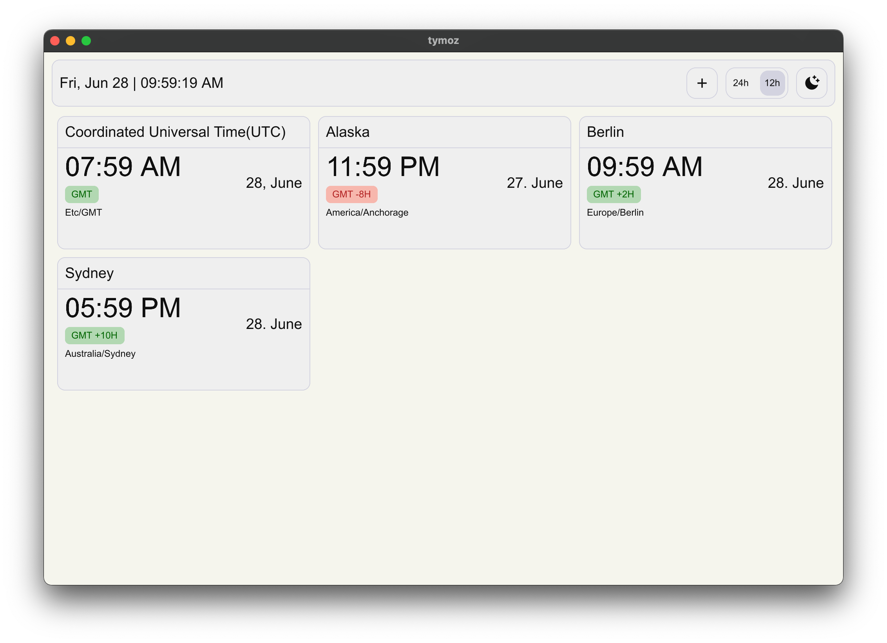
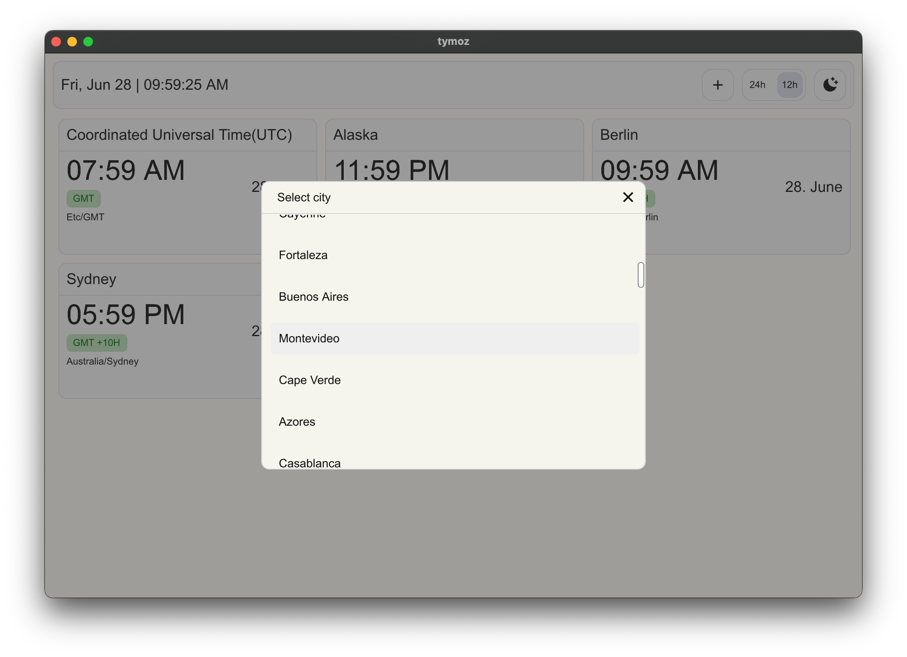
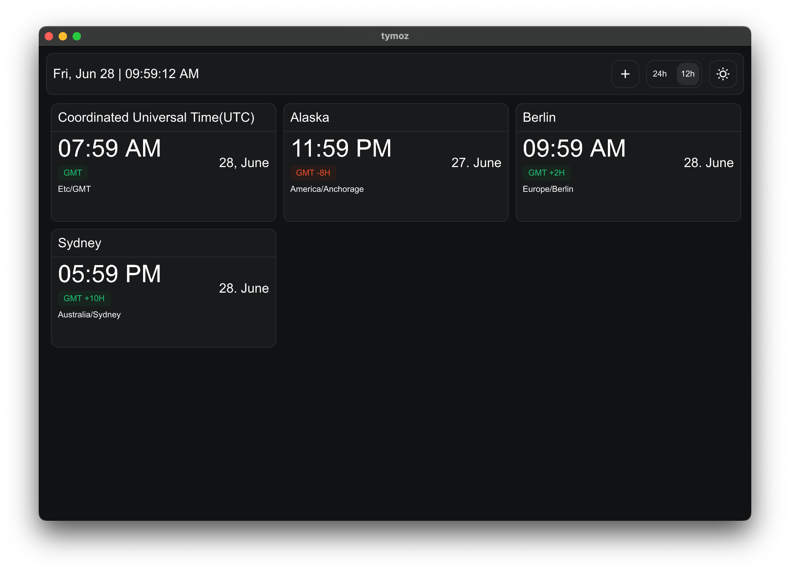
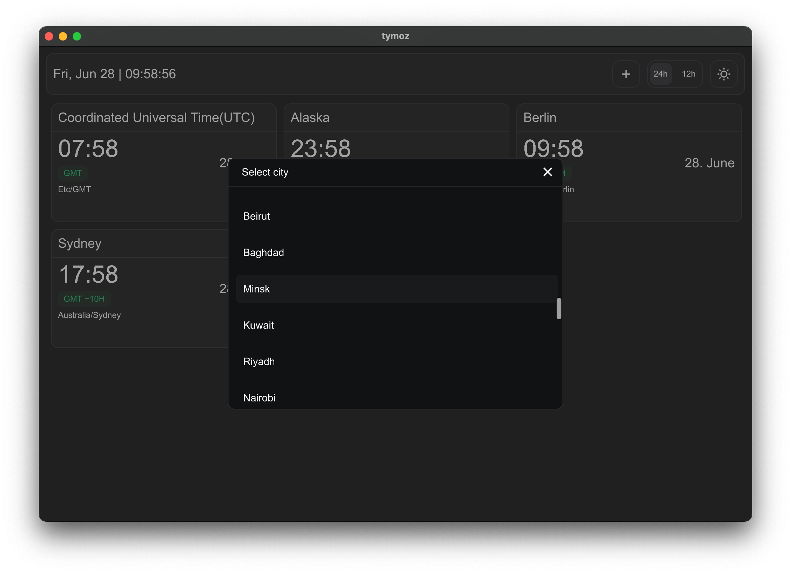

# tymoz

#### Easily Access and Manage Time Zone Information for Selected Cities

---

tymoz is a simple and intuitive application built using Rust for the backend and SlintUI for the user interface. This application helps you to display and manage the time for various cities across different time zones.

## Features

- **Time Zone Display:** View the current time for a selection of cities around the world.
- **City Selection:** Easily select cities from the list.
- **Time format:** Easily switch between 24-hour or 12-hour time format.
- **Dark and Light Theme Support** Toggle between dark and light themes through the toolbar button.
- **Cross-Platform:** Available as a desktop application and as a WebAssembly demo.

## Demo

Check out the live demo of Tymoz compiled to WebAssembly [here](https://arunpkio.github.io/tymoz/).


## Screenshots

### Light Theme



### Dark Theme



## Build and Run

   ```sh
   git clone https://github.com/arunpkio/tymoz.git
   cd tymoz
   cargo build --release
   cargo run
   ```

## License
tymoz is licensed under the MIT License.

   

